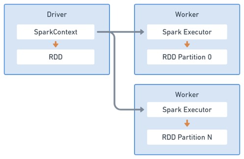
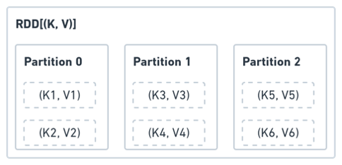
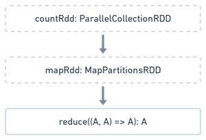
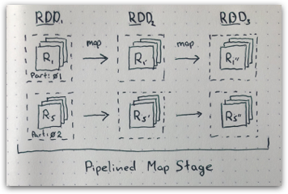
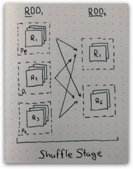

Apache Spark is a Scala library for writing distributed processing applications on the JVM.
Spark is fundamentally built on map-reduce model of computation with added optional persistance intermediate stages.
Spark provides a nice functional-looking API that allows us to treat distributed collections much like we would treat normal collections. However, it is important to develop a mental model of how spark operates in order to effectively write and debug spark applications.



When you write and deploy a Spark program it runs on a single JVM termed the "Driver".
One of the first things a Spark program will do is create a `SparkContext` which is both your interface to the cluster and job scheduler for task execution.

```scala
import org.apache.spark.{SparkConf, SparkContext}

implicit val sparkContext =
  SparkContext.getOrCreate(
    (new SparkConf(loadDefaults =  true))
      .setMaster("local[*]")
      .setAppName("Demo")
      .set("spark.serializer", "org.apache.spark.serializer.KryoSerializer")
      .set("spark.kryo.registrator", "geotrellis.spark.store.kryo.KryoRegistrator")
 )
```

## RDD: Resilient Distributed Dataset

Spark application represents computation as operations on RDD objects which are owned by the SparkContext.
RDD is a lazy, partitioned, distributed collection. An RDD "contains" partitions of its data.



### Actions and Transformations
The instantiation of the RDD partitions and their data happens on remote executors during task execution.
RDD class instance on the driver captures only the data dependency and reference to work to be performed on that data.

```scala
import scala.math.random
import org.apache.spark.rdd.RDD

val slices = 32
val n = math.min(100000L * slices, Int.MaxValue).toInt // avoid overflow

val countRdd: RDD[Int] = sparkContext.parallelize(1 until n, slices)

val mapRdd: RDD[Int] = countRdd.map { i =>
  val x = random * 2 - 1
  val y = random * 2 - 1
  if (x*x + y*y <= 1) 1 else 0
}

val count: Int = mapRdd.reduce { (a, b) => a + b}

println(s"Pi is roughly ${4.0 * count / (slices - 1)}")
```

Each RDD has a data dependency on its parents each RDD is represented as a Direct Acyclic Graph (DAG).
There are two things you can do with such a DAG: continue building it or evaluate it.



- *Transformation* adds a level to the DAG, producing another `RDD`
- *Action* Evaluates the DAG and schedules it as Tasks on the cluster

In this example call to `countRdd.map` is a transformation and call to `mapRdd.reduce` is an action.

One tempting action is `.collect`. Collecting causes all of the executors to send their records to the driver where it can be "collected" into a single `Array`. Since the point of spark is to work with datasets larger than memory this action often results in Out of Memory Error on the driver. Caution should be taken when using it in production code.

### Forking DAGs

It is tempting to think that each RDD object represents a specific state of the data as it traverses the DAG, thus they can be used like variables to to build on the computation. For instance if we wanted to validate the count of `mapRdd` in the next line like so:

```scala
val samples = mapRdd.count()
```

The DAG would look like:


One imagines that results of `mapRdd` will be reused for both actions, **this is not true**.
The execution of the program results in two actions: reduce followed by count. Each one will result in DAG evaluation which will resolve all the dependencies and work in `mapRdd` will be done twice.

## Stages

Spark executes the DAG in stages, of which there are two types: Map and Shuffle.

### Map Stage



At the very lowest level each partition of RDD is evaluated as applying a function to an iterator of records: [MapPartitionsRDD.compute](https://github.com/apache/spark/blob/0d997e5156a751c99cd6f8be1528ed088a585d1f/core/src/main/scala/org/apache/spark/rdd/MapPartitionsRDD.scala#L51-L52)

When multiple map transformations follow each-other and all the information required to produce output partition is present in parent partition these transformations can be pipelined, applying the full function stack for each record.


### Shuffle Stage



When the data required for each output record may be spread across several partitions of the parent RDD a shuffle stage is required. This is the case with `.groupByKey` and `.reduceByKey` operations.

During the shuffle stage each parent partition is grouped by target partition number, those chunks are written to disk and sent over the network to executors responsible for evaluation of corresponding partition in the next stage.

Often during shuffle every record tries to go where its not. This turns the network into a bottleneck for the spark application. Additionally since the full dataset is always written to disk as part of a shuffle it will place additional strain on the storage.

In reality shuffles are required to do useful work but their number should be minimized to benefit performance. Therefore it is helpful to be aware which types of operations will require a shuffle in your application.

## Caching

This can be avoided by calling either `mapRdd.cache` or `mapRdd.persist(StorageLevel.MEMORY_ONLY)`.
The `.persist` method marks the RDD with a flag that will cause its partitions to be cached on the executors. Persisting an RDD will short-circuit its evaluation and re-use previous results, if available.

Caching should not be used blindly. In many situation its faster to read data from external source and duplicate transformations. After all caching has its own overhead. Memory-only RDD persistance competes with memory required to perform the transformation and on-disk persistance involves a whole new storage subsystem in your job.

Typically only stages used multiple times that have been results of several shuffles should be cached.
